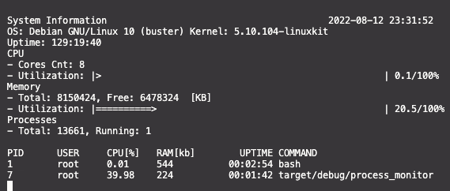

# Linux Process Monitor

This is a linux process monitor implemented in Rust.
The project is similar to `top` and was inspired by [Udacity's System Monitor C++ project](https://github.com/udacity/CppND-System-Monitor).
I implemented this project to learn Rust while going through the [rust book](https://doc.rust-lang.org/book/).

This is an example of the output produced while running in the provided docker container.

## Running This Project

This project will only run in linux systems.
If you are using MacOS or Windows, the project can be run in a docker container using the provided dockerfile.

### Local

To run this projct locally

1. Install the rust tool chain
2. Navigate to the root of this project (process_monitor) and run the following command

`cargo run`

### Docker

A Dockerfile is also provided for running this project with in a container.
Run the following command at the root of this repo:
`docker-compose run --rm dev`